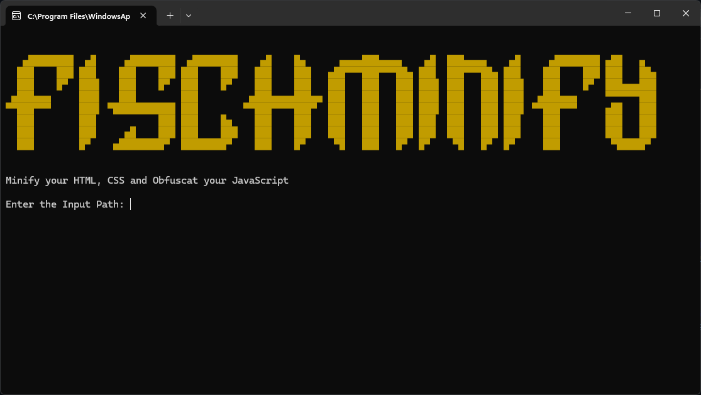

# FischMinify

FischMinify is a Python designed to minify HTML, CSS and obfuscate JavaScript files. This allows you to reduce the file size and make the code unreadable.

## Features

- Minification HTML and CSS files: Removes spaces, line breaks and comments from HTML files.
- JavaScript file obfuscation: Uses [UglifyJS](https://github.com/mishoo/UglifyJS) to obfuscate JavaScript files and make them unreadable.

## How to use

1. Make sure you have Python installed on your system.
2. Install the required Python packages by running `pip install -r requirements.txt`.
3. Start the script by running `python fischminify.py`.
4. Enter the path to the folder containing the files to be edited.
5. Enter the path to the initial folder where you want to save the edited files.
6. The script will copy, minify and obfuscate the files. The edited files are saved in the output folder.
